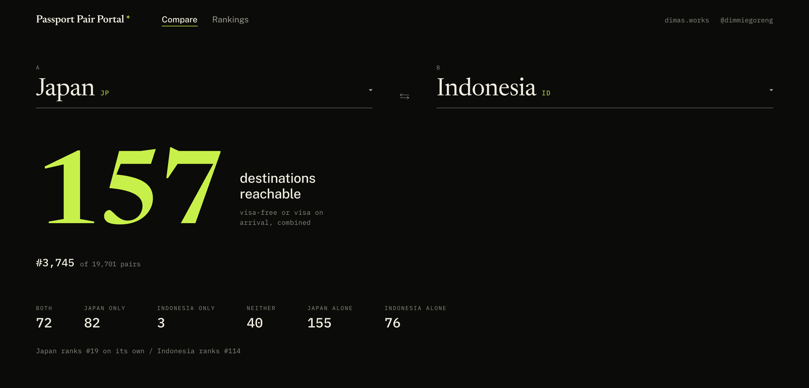
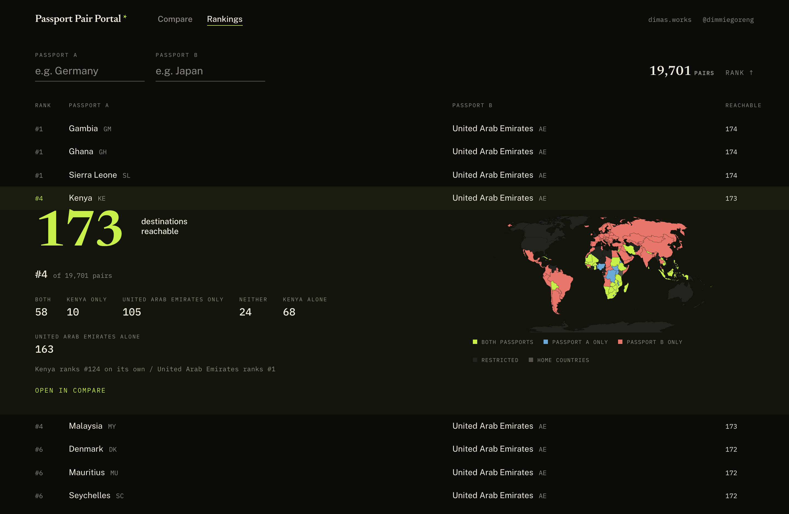
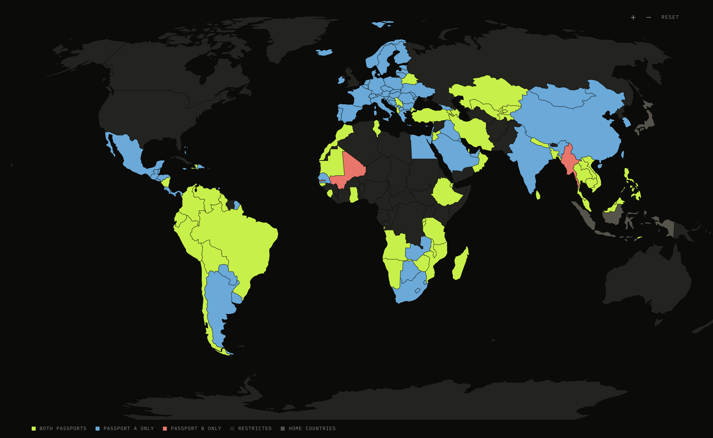

<div align="center">


# Passport Pair Portal

**How far do two passports reach together?**

[](https://passports.dimas.works)
[](https://github.com/dimslalom/Passport-Pair-Portal/actions/workflows/update-data.yml)
[](#how-the-ranking-works)
[](#stack)

[Live site](https://passports.dimas.works) &nbsp;·&nbsp; [Why pairs](#two-strong-passports-are-usually-a-waste) &nbsp;·&nbsp; [How it works](#how-the-ranking-works) &nbsp;·&nbsp; [Quick start](#quick-start) &nbsp;·&nbsp; [Data](#the-data)

</div>



Hold two passports and your reach is the **union** of both, never the sum. Passport Pair Portal
computes that union for every one of the 19,701 country pairs, ranks them, and paints the result on
a Robinson-projection world map. There is no backend and no API key: one 39,601-row CSV is parsed in
the browser at load, and every pair is precomputed before the first paint.

## Two strong passports are usually a waste

The intuition says pair the two strongest passports. The data says the opposite, because two strong
passports go to the same places.

| Pair | Alone | Together | Overlap | Rank |
|------|-------|----------|---------|------|
| Denmark + Spain | 157 and 157 | **158** | 156 destinations | #2,811 |
| UAE + Sierra Leone | 162 and 59 | **174** | 47 destinations | **#1** |

<sup>Counted over the 197 destinations left once both home countries are removed, so the numbers
line up with the pair math below.</sup>

Denmark and Spain tie for second strongest in the world on their own. Held together they buy exactly
one extra country. The United Arab Emirates paired with Sierra Leone, a passport ranked #142, tops
all 19,701 combinations, because Sierra Leone opens 12 doors the Emirati passport cannot.

That gap is the whole point of the project: what matters is not strength, it is **complementarity**.

## What it does

**Compare** any two passports. The count, the rank, the split between both / A only / B only /
neither, and a per-destination entry table for all 197 remaining countries.

**Browse** all 19,701 pairs ranked by combined reach, filter by either passport, and expand any row
for the full breakdown without leaving the table.



Every country on the map is colored by which of the two documents gets you in.



## How the ranking works

A destination counts as **reachable** when entry needs no advance approval from an embassy, which
means visa-free or visa on arrival. E-visas and ETAs do not count: they are paperwork before you
fly. The two home countries are excluded from every pair, leaving 197 destinations to compare.

```
        ╭─────────────── Japan ───────────────╮
        │                                     │
        │                 ╭───────────────────┼─── Indonesia ───╮
        │       82        │        72         │        3        │
        │   only Japan    │       both        │ only Indonesia  │
        │                 ╰───────────────────┼─────────────────╯
        │                                     │
        ╰─────────────────────────────────────╯

        combined reach = 82 + 72 + 3 = 157          out of reach for either = 40
```

The map above is that diagram drawn on a globe. Japan carries the pair almost everywhere, Indonesia
adds three countries Japan cannot reach, and the two overlap on 72.

The load-time pass is plain set arithmetic:

1. Parse the CSV into `data[passport][destination] -> AccessLevel`
2. Score every passport: the count of destinations at level 2 or higher
3. Rank the 199 passports by that score, with ties sharing a rank
4. For each of the C(199, 2) = 19,701 pairs, count the union of the two reachable sets
5. Sort the pairs by union size and store every rank in a `Map<"A|B", rank>`

Step 4 is the expensive one at roughly 3.9 million membership tests, and it runs once. After that,
any pair's rank is an O(1) lookup, which is what makes expanding a ranking row feel instant.

## Quick start

```bash
git clone https://github.com/dimslalom/Passport-Pair-Portal.git
cd Passport-Pair-Portal
npm install
npm run dev
```

The dev server prints its URL, usually <http://localhost:5173>. The travel data is read from
`public/data/travel-index.csv` at runtime, so there is nothing to configure and no key to set.

```bash
npm run build      # tsc -b && vite build, output in dist/
npm run preview    # serve the production build
npm run lint       # eslint
```

## The data

Source: [passport-index-dataset](https://github.com/ilyankou/passport-index-dataset) by
[ilyankou](https://github.com/ilyankou). One row per passport and destination, 39,601 rows for
199 x 199 countries.

| Passport | Destination | Requirement |
|----------|-------------|-------------|
| Indonesia | Japan | `visa required` |
| Japan | Indonesia | `30` |
| Germany | Brazil | `90` |

`Requirement` arrives as free text and is normalized once at parse time. A bare number is a
day-count, which is the dataset's way of writing visa-free with a stay limit:

| Level | Source text | Meaning | Counts as reach |
|:-----:|-------------|---------|:---------------:|
| `3` | `visa free`, `90`, `30`, `180` | No approval needed | yes |
| `2` | `visa on arrival` | Approval granted at the border | yes |
| `1` | `e-visa`, `eta` | Online approval before travel | no |
| `0` | `visa required` | Embassy approval required | no |
| `-1` | `-1` | Own country, or no route | no |

<details>
<summary><b>Map color legend</b></summary>

<br />

| Swatch | Token | Meaning |
|--------|-------|---------|
| Lime `#c8f04a` | `--color-access-both` | Reachable by both passports |
| Blue `#6aa9d8` | `--color-access-a` | Reachable by passport A only |
| Coral `#e8766b` | `--color-access-b` | Reachable by passport B only |
| Near-black `#232320` | `--color-map-restricted` | Out of reach for both |
| Warm gray `#55534a` | `--color-map-home` | The two selected home countries |

Geometry comes from a 110m TopoJSON world served locally, projected with `geoRobinson` from
`d3-geo-projection`. Twelve country names differ between the TopoJSON and the CSV (`Czechia` against
`Czech Republic`, `eSwatini` against `Swaziland`, and so on) and are bridged by a lookup table in
[`WorldMap.tsx`](src/components/WorldMap.tsx).

</details>

<details>
<summary><b>Weekly refresh</b></summary>

<br />

A GitHub Actions workflow pulls the upstream CSV every Monday at 00:00 UTC, and only commits when
the bytes actually changed. The commit triggers the usual Netlify build, so the site follows visa
policy without anyone touching it. `workflow_dispatch` is enabled for manual runs.

```
Monday 00:00 UTC
      |
      v
curl the upstream CSV  ->  diff against public/data/travel-index.csv
      |                            |
   unchanged                    changed
      |                            |
      v                            v
   stop                    commit, push, redeploy
```

See [`.github/workflows/update-data.yml`](.github/workflows/update-data.yml).

</details>

## Project layout

```
src/
├── components/
│   ├── DocumentSelector.tsx   type-to-filter passport picker
│   ├── ScoreCard.tsx          the big number, rank, and the six figures
│   ├── WorldMap.tsx           Robinson map, zoom, hover tooltip, legend
│   ├── DestinationTable.tsx   sortable per-destination entry table
│   └── RankingsTab.tsx        all 19,701 pairs, filtered and expandable
├── lib/
│   ├── travel.ts              CSV parsing, scoring, pair ranking
│   └── iso.ts                 country name -> ISO alpha-2 via Intl.DisplayNames
├── App.tsx                    tab shell and selection state
└── App.css                    design tokens and every component style

public/data/
├── travel-index.csv           the dataset, refreshed weekly
└── world-110m.json            TopoJSON geometry
```

## Stack

React 19 and TypeScript on Vite, `react-simple-maps` with `d3-geo-projection` for the map,
`papaparse` for the CSV, and hand-written CSS driven by custom properties. No UI framework, no state
library, no server. The build is fully static and deploys to Netlify.

Type is set in Newsreader, Public Sans, and IBM Plex Mono. Every text color in the palette is tested
to clear WCAG AA contrast against the canvas.

## Credits

Travel access data is maintained by [ilyankou](https://github.com/ilyankou) in
[passport-index-dataset](https://github.com/ilyankou/passport-index-dataset) and carries its own
license. Built by [@dimmiegoreng](https://instagram.com/dimmiegoreng).
